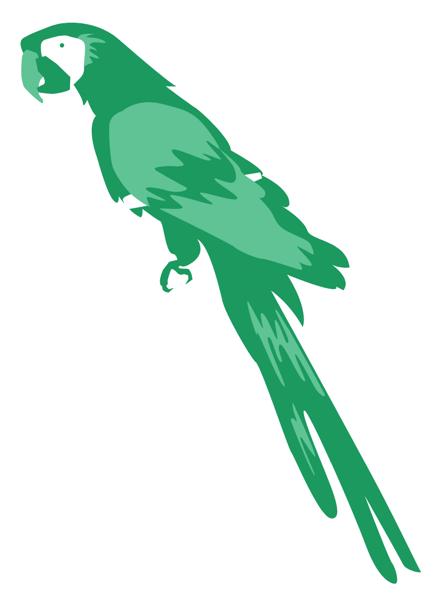

[](https://github.com/PrithivirajDamodaran/Parrot/blob/main/LICENSE)


# Parrot
Parrot is a paraphrase based utterance augmentation framework purpose built to accelerate training NLU models. A paraphrase framework is more than just a paraphrasing model.



## Table of contents
- [1. Why Parrot?](#1-why-parrot-)
- [2. Getting started](#2-getting-started)
  * [Install](#install)
  * [Quickstart](#quickstart)
  * [Getting syntactic and phrasal diversity/variety in your paraphrases ?](#getting-syntactic-and-phrasal-diversity-variety-in-your-paraphrases--)
  * [Other Knobs](#other-knobs)
- [3. Scope](#3-scope)
- [4. What makes a paraphraser a good augmentor for NLU? (Details)](#4-what-makes-a-paraphraser-a-good-augmentor-for-nlu---details-)
  * [Sample NLU data (Rasa format)](#sample-nlu-data--rasa-format-)
- [5.Dataset for paraphrase model](#5dataset-for-paraphrase-model)
- [6.Metrics and Comparison](#6metrics-and-comparison)
- [7.Current Features](#7current-features)
- [8.Roadmap](#8roadmap)
- [9.Current Limitations/Known issues](#9current-limitations-known-issues)
- [10.References](#10references)
- [11.Citation](#11citation)


## 1. Why Parrot?
**Huggingface** lists [12 paraphrase models,](https://huggingface.co/models?pipeline_tag=text2text-generation&search=paraphrase)  **RapidAPI** lists 7 fremium and commercial paraphrasers like [QuillBot](https://rapidapi.com/search/paraphrase?section=apis&page=1), Rasa has discussed an experimental paraphraser for augmenting text data [here](https://forum.rasa.com/t/paraphrasing-for-nlu-data-augmentation-experimental/27744), Sentence-transfomers offers a [paraphrase mining utility](https://www.sbert.net/examples/applications/paraphrase-mining/README.html) and [NLPAug](https://github.com/makcedward/nlpaug) offers word level augmentation with a [PPDB](http://paraphrase.org/#/download) (a multi-million paraphrase database). While these attempts at paraphrasing are great, there are still some gaps and paraphrasing is NOT yet a mainstream option for text augmentation in building NLU models....Parrot is a humble attempt to fill some of these gaps.

**What is a good paraphrase?** Almost all conditioned text generation models are validated  on 2 factors, (1) if the generated text conveys the same meaning as the original context (Adequacy) (2) if the text is fluent / grammatically correct english (Fluency). For instance Neural Machine Translation outputs are tested for Adequacy and Fluency. But [a good paraphrase](https://www.aclweb.org/anthology/D10-1090.pdf) should be adequate and fluent while being as different as possible on the surface lexical form. With respect to this definition, the  **3 key metrics** that measures the quality of paraphrases are:
 - **Adequacy** (Is the meaning preserved adequately?) 
 - **Fluency** (Is the paraphrase fluent English?) 
 - **Diversity (Lexical / Phrasal / Syntactical)** (How much has the paraphrase changed the original sentence?)

*Parrot offers knobs to control Adequacy, Fluency and Diversity as per your needs.*

**What makes a paraphraser a good augmentor?** For training a NLU model we just don't need a lot of utterances but utterances with intents and slots/entities annotated. Typical flow would be:
- Given an **input utterance  + input annotations** a good augmentor spits out N **output paraphrases** while preserving the intent and slots. 
 - The output paraphrases are then converted into annotated data using the input annotations that we got in step 1.
 - The annotated data created out of the output paraphrases then makes the training dataset for your NLU model.

But in general being a generative model paraphrasers doesn't guarantee to preserve the slots/entities. So the ability to generate high quality paraphrases in a constrained fashion without trading off the intents and slots for lexical dissimilarity makes a paraphraser a good augmentor. *More on this in section 3 below*

## 2. Getting started
### Install
```python
pip install git+https://github.com/PrithivirajDamodaran/Parrot.git
```

### Quickstart
```python


from parrot import Parrot
import torch
import warnings
warnings.filterwarnings("ignore")

''' 
uncomment to get reproducable paraphrase generations
def random_state(seed):
  torch.manual_seed(seed)
  if torch.cuda.is_available():
    torch.cuda.manual_seed_all(seed)

random_state(1234)
'''

#Init models (make sure you init ONLY once if you integrate this to your code)
parrot = Parrot(model_tag="prithivida/parrot_paraphraser_on_T5", use_gpu=False)

phrases = ["Can you recommed some upscale restaurants in Newyork?",
           "What are the famous places we should not miss in Russia?"
]

for phrase in phrases:
  print("-"*100)
  print("Input_phrase: ", phrase)
  print("-"*100)
  para_phrases = parrot.augment(input_phrase=phrase)
  for para_phrase in para_phrases:
   print(para_phrase)
```

```
----------------------------------------------------------------------
Input_phrase: Can you recommed some upscale restaurants in Newyork?
----------------------------------------------------------------------
list some excellent restaurants to visit in new york city?
what upscale restaurants do you recommend in new york?
i want to try some upscale restaurants in new york?
recommend some upscale restaurants in newyork?
can you recommend some high end restaurants in newyork?
can you recommend some upscale restaurants in new york?
can you recommend some upscale restaurants in newyork?
----------------------------------------------------------------------
Input_phrase: What are the famous places we should not miss in Russia
----------------------------------------------------------------------
what should we not miss when visiting russia?
recommend some of the best places to visit in russia?
list some of the best places to visit in russia?
can you list the top places to visit in russia?
show the places that we should not miss in russia?
list some famous places which we should not miss in russia?
```
### Getting syntactic and phrasal diversity/variety in your paraphrases ?

You can play with the do_diverse knob (checkout the next section for more knobs). 
Consider this example: **do_diverse = False (default)***
```
------------------------------------------------------------------------------
Input_phrase: How are the new Macbook Pros with M1 chips?
------------------------------------------------------------------------------
'how do you rate the new macbook pros? '
'how are the new macbook pros? '
'how is the new macbook pro doing with new chips? '
'how do you like the new macbook pro m1 chip? '
'what is the use of the new macbook pro m1 chips? '
```
**do_diverse = True**
```
------------------------------------------------------------------------------
Input_phrase: How are the new Macbook Pros with M1 chips?
------------------------------------------------------------------------------
'what do you think about the new macbook pro m1? '
'how is the new macbook pro m1? '
'how are the new macbook pros? '
'what do you think about the new macbook pro m1 chips? '
'how good is the new macbook pro m1 chips? '
'how is the new macbook pro m1 chip? '
'do you like the new macbook pro m1 chips? '
'how are the new macbook pros with m1 chips? '
```

### Other Knobs
```python

 para_phrases = parrot.augment(input_phrase=phrase, 
                               diversity_ranker="levenshtein",
                               do_diverse=False, 
                               max_return_phrases = 10, 
                               max_length=32, 
                               adequacy_threshold = 0.99, 
                               fluency_threshold = 0.90)

```

## 3. Scope

In the space of conversational engines, knowledge bots are to which **we ask questions** like *"when was the Berlin wall teared down?"*, transactional bots are to which **we give commands** like *"Turn on the music please"* and voice assistants are the ones which can do both answer questions and action our commands. Parrot mainly foucses on augmenting texts typed-into or spoken-to conversational interfaces for building robust NLU models. (*So usually people neither type out or yell out long paragraphs to conversational interfaces. Hence the pre-trained model is trained  on text samples of maximum length of 32.*)

*While Parrot predominantly aims to be a text augmentor for building good NLU models, it can also be used as a pure-play paraphraser.*


## 4. What makes a paraphraser a good augmentor for NLU? (Details)

To enable automatic training data generation, a paraphraser needs to keep the slots in intact. So the end to end process can take input utternaces, augment and convert them into NLU training format goo et al or rasa format (as shown below). The data generation process needs to look for the same slots in the output paraphrases to derive the start and end positions.(as shown in the json below)

 

Ideally the above process needs an UI like below to collect to input utternaces along with annotations (Intents, Slots and slot types) which then can be agumented and converted to training data.

 


### Sample NLU data (Rasa format)

```json
{
    "rasa_nlu_data": {
        "common_examples": [
            {
                "text": "i would like to find a flight from charlotte to las vegas that makes a stop in st. louis",
                "intent": "flight",
                "entities": [
                    {
                        "start": 35,
                        "end": 44,
                        "value": "charlotte",
                        "entity": "fromloc.city_name"
                    },
                    {
                        "start": 48,
                        "end": 57,
                        "value": "las vegas",
                        "entity": "toloc.city_name"
                    },
                    {
                        "start": 79,
                        "end": 88,
                        "value": "st. louis",
                        "entity": "stoploc.city_name"
                    }
                ]
            },
            ...
        ]
    }
}
```

 - **Original**:  I would like a list of round trip flights between indianapolis and orlando florida for the 27th
 - **Paraphrase useful for augmenting**: what are the round trip flights between indianapolis and orlando for the 27th
 - **Paraphrase not-so-useful for augmenting**: what are the round trip flights between chicago and orlando for the 27th.


## 5.Dataset for paraphrase model

The paraphrase generation model prithivida/parrot_paraphraser_on_T5 has been fine tuned on the following datasets.

 - MSRP Paraphrase 
 - Google PAWS 
 - ParaNMT 
 - Quora question pairs. 
 - SNIPS Alexa commands
 - MSRP Frames

##  6.Metrics and Comparison
TBD

## 7.Current Features
TBD

## 8.Roadmap
TBD

## 9.Current Limitations/Known issues
<ul>
 <li> The diversity scores are not normalised each of the diversity rankers scores paraphrases differently </li>
 <li> Some command style input phrases generate less adequate paraphrases</li>
</ul>

## 10.References
TBD

## 11.Citation
TBD
