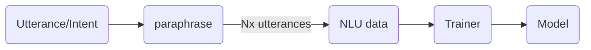

# Parrot


## 1. Why Parrot?
**Huggingface** lists [12 paraphrase models,](https://huggingface.co/models?pipeline_tag=text2text-generation&search=paraphrase)  **RapidAPI** lists 7 fremium and commercial paraphrasers like [QuillBot](https://rapidapi.com/search/paraphrase?section=apis&page=1), Rasa has discussed an experimental paraphraser for augmenting text data [here](https://forum.rasa.com/t/paraphrasing-for-nlu-data-augmentation-experimental/27744). While these attempts at paraphrasing are great, there are still some gaps and paraphrasing is NOT yet a mainstream option for text augmentation in building NLU models....Parrot is a humble attempt to fill some of these gaps.

What is a good paraphrase ? Almost all conditoned generation models are measured to generate text that conveys the same meaning as the original context (Adequacy) in fluent and grammtically correct english (Fluency) for instance Neural Machine Translation is measured to have Adequacy and Fluency. But [a good paraphrase](https://www.aclweb.org/anthology/D10-1090.pdf) should be adequate and fluent while being as different as possible on the surface form. With respect to this definition, the  **3 key metrics** that measures the quality of paraphrases are:

 - **Adequacy** (Is the meaning preserved adequately?) 
 - **Fluency** (Is the paraphrase fluent English?) 
 - **Diversity or Lexical Dissimilarity** (How much has the paraphrase changed the original sentence?)

*Parrot offers knobs to control Adequacy, Fluency and Diversity for your needs.*

### Installation
```python
pip install parrot
```

### Quickstart
```python
 import Parrot
 import pandas as pd
 pd.set_option('max_colwidth', -1)
 parrot = Parrot("prithivida/parrot_paraphraser_T5","cuda:0")
 phrase = ""
 df = parrot.augment(input_phrase = phrase)
 df.head(df.shape[0])
```

## 2. Scope

In the space of conversational engines, knowledge bots are to which **we ask questions** like *"when was the Berlin wall teared down?"*, transactional bots are to which **we give commands** like *"Turn on the music please"* and voice assistants are the ones which can do both answer questions and action our commands. Parrot mainly foucses on augmenting texts typed-into or spoken-to conversational interfaces for building robust NLU models. (*So usually people neither type out or yell out long paragraphs to conversational interfaces. Hence the pretrained model is trained  on text samples of maximum length of 64.*)

While Parrot predominantly aims to be a text augmentor for building good NLU models, it can also be used as a pure-play paraphraser.*


## 3. What makes a paraphraser a good augmentor for NLU?

It means to take intent utternaces, augment and convert them into NLU training format goo et al or rasa format.

To enable automatic training data generation, slots needs to be intact.

The paraphraser outputs should be useful to create Task specific training data. Consider the examples below.




### Sample NLU data (Rasa format)

```json
{
    "rasa_nlu_data": {
        "common_examples": [
            {
                "text": "i would like to find a flight from charlotte to las vegas that makes a stop in st. louis",
                "intent": "flight",
                "entities": [
                    {
                        "start": 35,
                        "end": 44,
                        "value": "charlotte",
                        "entity": "fromloc.city_name"
                    },
                    {
                        "start": 48,
                        "end": 57,
                        "value": "las vegas",
                        "entity": "toloc.city_name"
                    },
                    {
                        "start": 79,
                        "end": 88,
                        "value": "st. louis",
                        "entity": "stoploc.city_name"
                    }
                ]
            },
            ...
        ]
    }
}
```

**A good augmentor**
For instance, the below example preserves adequacy (in NLU context: the intent and slots are intact), fluency (grammar is fine) and offers some diversity as for as the utternace is concerned.

 - **Original**:  I would like a list of round trip flights between indianapolis and orlando florida for the 27th
 - **Paraphrase**: what are the round trip flights between indianapolis and orlando for the 27th

**A poor augmentor**
While the above example is the strict expectation from a pure-play paraphraser, text augmenting offers some liberty.  As long as the augmentor retains the intent and grammar (with some diversity) in the paraphrases, it is acceptable even if the slots aren't intact. For instance, the below paraphrase is acceptable in an augmentor setting.

 - **Original**:  I would like a list of round trip flights between indianapolis and orlando florida for the 27th
 - **Paraphrase**: what are the round trip flights between chicago and orlando for the 3rd


### Pretrained model

 - MSRP Paraphrase 
 - Google PAWS 
 - ParaNMT 
 - Quora question pairs. 
 - SNIPS Alexa commands
 - MSRP Frames
 - GYAFC Dataset

###  Metrics and Comparison
TBD

### Current Features

### Roadmap
